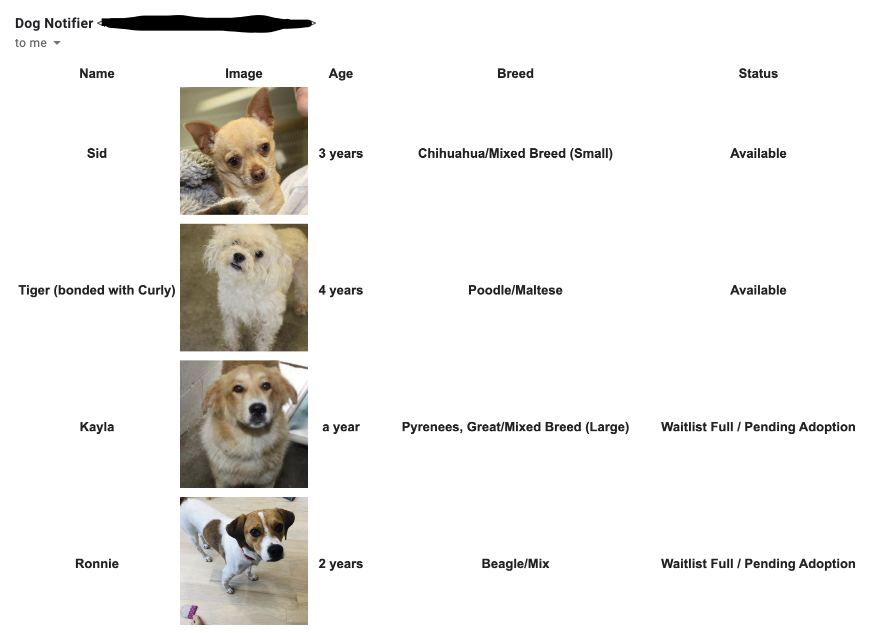

Scrapes muddy paws and sends emails about new dogs via google cloud function.

Quarkus based for no specific reason.

To setup:
    Fork the repo, and in your circleci config (or however you want to deploy it) file set the environment vars:
 
`MAILGUN_API_URL`: https://api.mailgun.net/v3/YOUR_DOMAIN

`MAILGUN_API_KEY`: Your mailgun api key for that domain

`FROM_EMAIL`: the email you want the email to come from (e.g no.reply@YOUR_DOMAIN)

`RECIPIENTS`: CSV of emails you'd like notifications sent to.

`GCP_PROJECT`: the project name in GCP

`GCP_BUCKET_NAME`: the bucket in which to store snapshots of adoptable dogs

I suggest throwing these into a yaml file since putting a csv into the `set-env-vars` command doesn't work very well.

Just run `mvn package` and then run:

```
gcloud beta functions deploy scrapeFunction \
              --entry-point=io.quarkus.gcp.functions.QuarkusBackgroundFunction \
              --runtime=java11 \
              --trigger-resource YOUR_TOPIC \
              --trigger-event google.pubsub.topic.publish \
              --source=/target/deployment \
              --project YOUR_PROJECT \
              --env-vars-file env.yml
```

I suggest setting up a cloud scheduler to publish a message to that topic every X minutes.

You should see an email like this: 

To note, you'll also require a cloud storage bucket, as the above environment variable suggests.

You'll get all the dogs currently listed on the page in the first run, and then in subsequent runs only get new dogs. 
Updates for existing dogs will not be sent.

Please be a nice consumer, and use care in how often you hit the site. I'd suggest a max of once every 5 minutes.

I make no promises on performance, cost, security, etc... that this function provides. It works for my purposes, and if
you'd like more feel free to open a PR.
